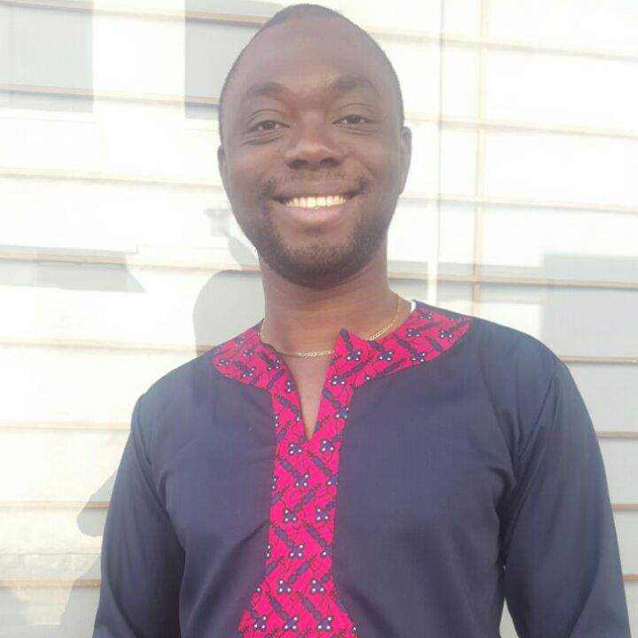
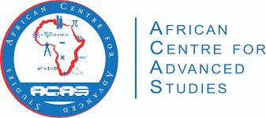
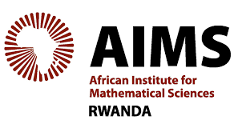

# À propos de moi: 
 

[**Yaé U. Gaba**](https://www.linkedin.com/in/gabayae): Professeur Assistant à l'[**Institut de Mathématiques et de Sciences Physiques (IMSP)**](http://imsp-benin.com/home/).
Mes intérêts de recherche sont la Topologie Algébrique Appliquée (Analyse Topologique des Données -- [**TDA**](https://en.wikipedia.org/wiki/Topological_data_analysis)), 
l'Apprentissage Automatique Géométrique (apprentissage de la représentation des graphes et des nuages de points). Je me concentre actuellement sur les méthodes géométriques et variationnelles dans l'analyse des données. 
Mon travail consiste principalement à concevoir des outils issus de la géométrie, de la topologie et de l'analyse fonctionnelle utiles pour l'analyse et la visualisation des données. Mon travail consiste également à rechercher les applications de la topologie asymétrique 
à l'analyse de la complexité des algorithmes et, dans cette ligne, je m'intéresse à développer des algorithmes pratiques d'apprentissage automatique avec des fondements théoriques rigoureux, établissant ainsi un pont entre les Mathématiques Pures et l'Informatique Théorique tout en ayant en vue
des applications pour le vivant.

 
 
 

## Mes partenaires et collaborateurs

[**African Center for Advanced Studies**](https://acas-yde.org/).

[**Quantum Leap Africa**](https://quantumleapafrica.org/).

[**AIMS Rwanda**](https://aims.ac.rw/).

[**AIMS-NEI**](https://aims.ac.za/).

 

[**Canergie Coporation**](https://www.carnegie.org/).

 

 

[**University of Rwanda**](https://ur.ac.rw/).

[**African Center of Excellence in Data Science**](https://aceds.ur.ac.rw/).

